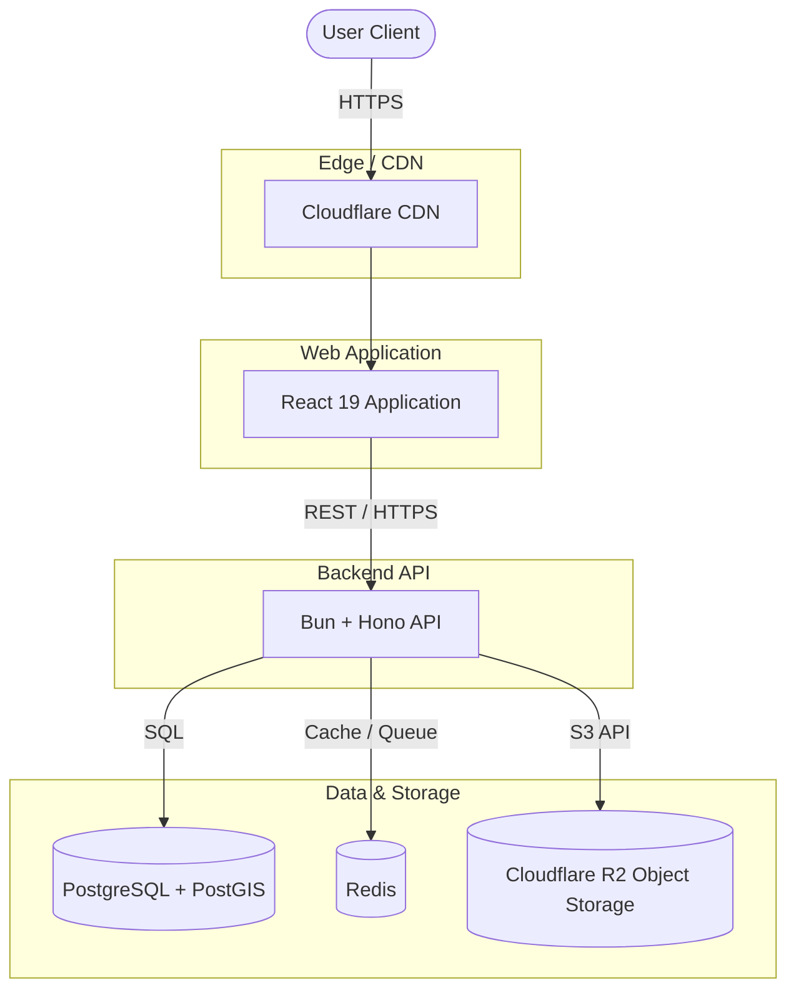

# Architecture Overview

This document explains the high-level architectural decisions and the underlying technology stack that powers Yume.

## The Modular Monolith

Yume is designed as a **Modular Monolith**. Every core business area (Identity, Companion, Communities, Experiences, Places, Atlas, Aura, Discover) is isolated behind clear module boundaries. 

### Why a Modular Monolith?
- **Single Deployment:** Eliminates the complexity of orchestrating multiple microservices during the MVP and early growth stages.
- **Easy Refactoring:** Clear boundaries between domains mean we can extract individual modules into microservices later only when scaling demands it.
- **Simple Development:** Engineers can run the entire stack locally without heavy container orchestration.
- **Developer Velocity Today, Scale Tomorrow:** We optimize for moving fast now while preserving the ability to scale efficiently in the future.

## Key Technology Choices

- **Why Bun?** 
  Extremely fast JavaScript runtime with native TypeScript support, a built-in package manager, and modern tooling, reducing our reliance on multiple Node.js utilities.
- **Why Hono?** 
  Minimal, composable, and framework-agnostic API framework that boasts excellent integration with Bun, prioritizing fast iteration and low complexity over heavy boilerplate like NestJS.
- **Why React (with Vite)?** 
  Industry standard for UI development, providing rapid development and an enormous ecosystem for our frontend application.
- **Why PostgreSQL?** 
  A highly reliable, scalable relational database. Integrated with **PostGIS** for native geospatial queries (e.g., finding nearby users, activities, or cafes).
- **Why Redis?** 
  Essential for caching, rate limiting, and real-time communication to ensure low-latency performance.

## High-Level Architecture Diagram

