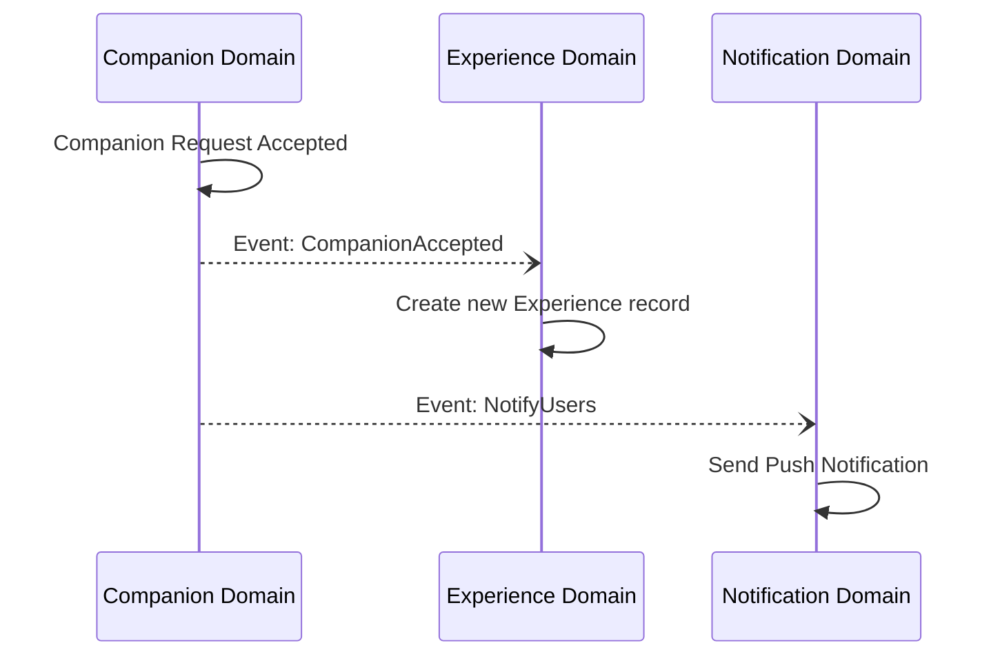

# Domain Driven Design

Yume is structured around independent, isolated domains. This ensures that the codebase remains maintainable, scalable, and easy to understand as it grows.

## Core Principle: Strict Data Ownership
Each domain **owns its data**. There is absolutely no cross-domain coupling at the database level (e.g., the Companion domain cannot directly read the Identity domain's tables). All cross-domain communication must happen through well-defined internal services or events.

## The Domains of Yume

- **Identity**: Manages user authentication, sessions, security, and core user profile data.
- **Companion**: Handles creating companion requests, matching users, managing invitations, and tracking status.
- **Communities**: Hubs for users with shared interests or locations to interact.
- **Experiences**: Tracks activities and events that users participate in together.
- **Places**: Manages geospatial location data, venues, and points of interest.
- **Journey**: The memory, journaling, and mapping engine where completed experiences are recorded for the user to look back on.
- **Aura**: The reputation and feedback system. After an experience, feedback updates a user's Aura.
- **Discover**: The recommendation engine to help users find new experiences, places, and companions.
- **Notifications**: Manages delivery of real-time alerts and emails.
- **Chat**: Real-time communication between users.

## Domain Isolation Map

```mermaid
block-beta
  columns 4
  
  block:Group1
    Identity
    Companion
    Communities
    Experiences
  end

  block:Group2
    Places
    Journey
    Aura
    Discover
  end

  block:Group3
    Notifications
    Chat
  end

  %% Styling
  classDef domain fill:#2D3748,stroke:#4A5568,stroke-width:2px,color:#fff,rx:5px
  class Identity,Companion,Communities,Experiences,Places,Journey,Aura,Discover,Notifications,Chat domain
```

## Internal Communication (Example)

Instead of direct database coupling, domains communicate via events or service calls.

