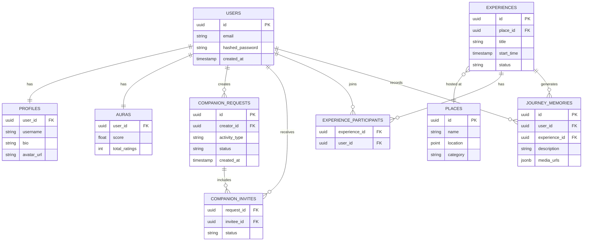

# Master ER Diagram

While each domain manages its own data and schemas, this high-level master Entity-Relationship Diagram visualizes the conceptual relationships between the core entities across the Yume platform.

> [!NOTE]
> Physical foreign keys may not exist between bounded contexts to enforce strict domain isolation. Relationships are logically enforced via application logic (Drizzle ORM) or domain events.

