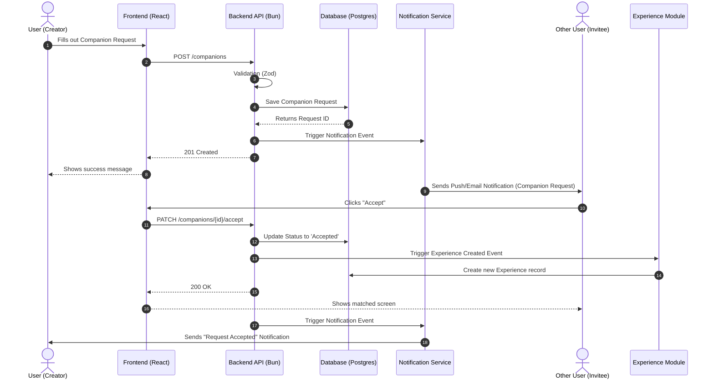

# Companion Flow

This sequence diagram illustrates the behavior when a User creates a new Companion Request and another user accepts it. 

Sequence diagrams are prioritized over static ER diagrams here because they clearly demonstrate system behavior, cross-domain communication, and the asynchronous nature of certain tasks (like notifications).

## Create Companion Request

