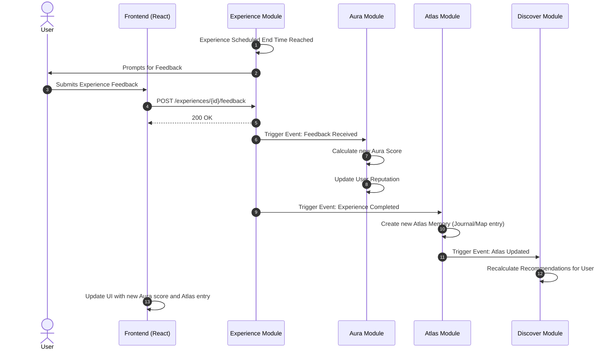

# Experience Flow

This document outlines the behavior and sequence of events when an Experience is completed. It demonstrates how multiple domains interact sequentially (Experience -> Feedback -> Aura -> Atlas -> Discover).

## Complete Experience Flow

